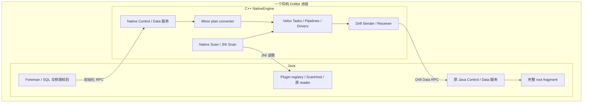

# Apache Drill Native Execution 设计方案（Review 版）

日期：2026-10-07。状态：实验实现，供架构 Review。

**采用同构 Java Drillbit：Java 保留规划、协调和完整 root fragment；每个节点内嵌 C++ NativeEngine，native 查询的所有非 root minor fragment 在 Velox 执行。Scan 可以使用 native reader，也可以通过 JNI 复用原 Java plugin reader。**

本文按当前同构 RPC 实现整理，替代此前分散的设计草案。实验原始数据和日志留在工作区，不作为源码提交内容。章节中的“设计约定”描述要保持的契约，“已验证”描述已有证据；前者不表示已经覆盖 Drill 的全部算子、函数和 plugin。

## 1. 本轮确定的设计边界

| 项目 | 设计约定 |
|---|---|
| 节点形态 | 只有一种 Java 启动的 Drillbit；每个进程可加载同一套 NativeEngine；只有一个节点身份和一条 ZooKeeper 注册记录 |
| Foreman | 保留原 SQL 规划、fragment 划分、minor assignment、状态协调和取消；执行完整 Java root fragment |
| Native 模式 | 全部非 root minor 使用 native 后端；同节点 Foreman 也可以执行 native 非 root minor |
| 计算 | 原 minor plan 在 C++ 转换为 Velox plan；fragment 内的计算、Sender/Receiver 和 driver 调度由 C++ 完成 |
| Scan | Java plugin 负责规划；具备 native provider 的 scan 使用 native reader，其余 scan 使用通用 JNI reader |
| 失败 | 未支持的算子、函数、类型、provider 或运行错误明确失败；没有 Java fragment fallback |
| Schema | 允许在 Task 绑定前发现初始 schema；绑定后固定，变化时报错。暂不支持动态 schema |
| 并行 | 每个 minor 对应一个 Velox Task；Task 内拆分 pipelines/drivers，多个 Task 共享进程线程池 |
| 默认线程池 | CPU 池和 Scan/I/O 池分别按进程可用逻辑 CPU 数设置；Linux 下考虑 CPU affinity |
| 当前验证 | 单节点 TPC-H SF1 Iceberg，跳过 Q5；对照 Java、native + JNI scan、native + SDK scan |

普通 Java 查询继续使用原执行路径。native 模式中调用 Java reader 是预先选定的 scan 实现，不是运行失败后的 fragment 后端切换。Plugin 本来具有的数据库查询下推、投影下推等读取行为可以保留。

本轮不展开内存预算、背压体系、spill、安全及部署配置/版本兼容设计；不将它们设为本次 Review 的前置条件。以下只描述执行所需的基本批次所有权、等待、取消和关闭契约。

## 2. 同构节点与职责划分



这里的 Foreman 是查询角色，native 是 fragment 执行后端，不形成第二种节点。一个节点可以同时是某查询的 Foreman 和 native worker；单节点场景下，root 在 Java，全部非 root 在本进程 NativeEngine。

Java storage plugin 继续拥有 catalog、snapshot、统计、文件/分区枚举、work/split、affinity 和 SubScan 生成逻辑。NativeEngine 消费已分配给当前 minor 的工作描述，不重新做全表规划或跨 minor 分配。

Java `NativeExecutionService` 负责加载引擎、绑定当前 JVM/ScanHost、启动 native listeners 和关闭。JNI scan 借用本节点原有 plugin 服务；不启动第二个 JVM，也不在 reader 旁创建完整 Java Drillbit 或 Java FragmentExecutor。

**主要入口：** [NativeExecutionService](../exec/java-exec/src/main/java/org/apache/drill/exec/nativeexecution/NativeExecutionService.java)、[NativeEngine](src/execution/NativeEngine.h)。

## 3. 节点发现、调度与查询生命周期

### 3.1 一次注册、两套执行入口

Java Drillbit 继续管理原 ZooKeeper session 和服务记录。原 endpoint 的 Java control/data 地址保持原用途；native 能力发布在同一个 endpoint 的扩展字段内，包含 native control/data 地址。C++ 不另注册一个 worker 身份。

启动顺序是准备 Java plugin 服务、创建 NativeEngine、绑定 native listeners、取得最终 endpoint，再发布可用能力。只有 native listener 和引擎就绪的节点才能进入 native 候选集；服务故障使相关查询失败并撤销可用能力。

`PlanFragment.assignment` 始终保留原规范 Drillbit endpoint。建立 native 连接时使用扩展地址，不通过改写 assignment 伪造一个节点。

### 3.2 冻结 fragment 路由

原并行化器完成 minor assignment 后，Foreman 冻结如下路由，并随初始化消息发送：

```text
fragment handle（queryId / majorId / minorId）
  → 原 assigned Drillbit
  → 执行后端：root = JAVA；所有 non-root = NATIVE
  → 已解析的 control/data 地址
```

Native 能力只决定候选节点和传输入口，不修改原 collectors、destinations、minor ID、hash 桶或硬 affinity 约束。数据发送不逐批访问 ZooKeeper。

现有 `foreman root-only` 调度策略可以将非 root 分配到其他节点；单节点验证使用允许 Foreman 承载非 root 的策略。Root-only 策略若没有可用其他 worker 应明确失败。

### 3.3 调度策略：候选节点、minor 宽度与工作分配

调度保留原 Drill 并行化器。Native 集成改变执行候选集及后端路由，不另建一套集群调度器，也不把 native reader 的 split 队列用于跨节点重新分配 minor。

**节点选择：**

| 查询与策略 | Root 候选 | 非 root 候选 | 无可用 worker / affinity 冲突 |
|---|---|---|---|
| 普通 Java 查询 | Foreman | 原在线节点集合 | 沿用原 Drill 规则 |
| Native，Foreman 可参与 | Foreman，Java 后端 | 在线且 native RPC 就绪的同构节点，包含满足条件的 Foreman | 无候选或必需 affinity 指向候选集外节点，失败 |
| Native，Foreman root-only | Foreman，Java 后端 | 上述集合排除 Foreman | 必须有其他 native 节点；不把任务转回 Foreman 或 Java |
| 只有 root 的查询 | Foreman | 不需要 | 不要求存在 native worker |

当前单节点测试使用 Foreman 可参与策略：一个节点承载完整 Java root 和全部 native 非 root。多节点时 root-only 可以隔离 Foreman 的计算负载，但不自动创造 worker，也不能绕过 plugin 的硬 affinity。

Native 就绪检查确认 control/data 服务能力，不等于预先验证该节点拥有每个 scan provider 或每个函数。各候选节点应装载查询所需 provider；当前缺失 provider 会在 native binding 时失败，尚未实现按 provider 清单筛选候选节点。

**Minor 宽度：**

Soft-affinity fragment 继续以原 `maxOperatorCost / sliceTarget` 计算初始宽度，并按原实现顺序约束：

```text
width = ceil(fragment.maxOperatorCost / sliceTarget)
width = min(width, fragment.maxWidth, query.maxGlobalWidth)
width = min(width, maxWidthPerNode × candidateNodeCount)
width = max(width, fragment.minWidth)
width = min(width, fragment.maxWidth)
width = max(width, 1)
```

这是当前 soft-affinity 代码的实际顺序；operator 最小宽度在后面生效，不将它改写成所有上下限都严格成立的简单 clamp。Root 按原 root 约束留在 Foreman。Hard-affinity fragment 使用原必需节点集合、各节点宽度上限及 affinity 分配逻辑，不套用 soft-affinity 的随机轮转。

当前沿用 Java 规划成本模型，尚未按 Velox 实测成本重新估算宽度。历史性能测试的 planner max width 1 限制的是 major 的 minor 数量，不会把单个 Velox Task 的 driver 上限限制为 1。

**Placement 与 scan work：**

- Soft affinity 在 native 候选集中优先分配有 affinity 的节点，剩余槽位沿用原随机起点轮转；不按 native Task 的实时队列长度重新 placement。
- Hard affinity 必须满足原必需节点和 work 宽度约束。排除 Foreman 或未就绪 native 节点导致冲突时直接失败，不静默降低 affinity。
- Endpoint assignment 后，由原 plugin 给各 minor 生成 SubScan/assigned work。JNI/native reader 均只消费当前 minor 的工作，不能重复枚举或跨 minor 领取。
- 一次查询冻结 backend/地址和 destinations；运行中不迁移 minor、不跨节点 work stealing，也不在失败后重试为 Java fragment。

### 3.4 提交与执行顺序

1. Java Foreman 完成物理规划、minor assignment 和路由冻结，先注册完整 Java root 的接收入口。
2. 按原 Drill 的 intermediate/leaf 启动流程，将原 minor fragment plan 和路由上下文通过 native Control RPC 提交。
3. Native runtime 核对 handle、assignment、后端及目的地址，登记 minor 和预期 Receiver inbox，再确认接纳。
4. Scan 或上游 Receiver 提供初始 schema；C++ 完成表达式绑定、schema 检查和计划转换，创建 Velox Task。
5. Task 在公共 CPU 池中推进 drivers；scan 等待由公共 I/O 池处理，exchange 按冻结路由发送。
6. Native fragment 状态通过原 Control RPC 报告给 Java Foreman；最终输出通过原 Data RPC 进入完整 Java root。
7. 错误或取消终止 Task，通知相关 sender/receiver，关闭 reader；节点关闭先停止接纳并排空 native 工作，再释放 Java scan 服务。

**同进程提交、状态上报和到 Java root 的输出，目前也使用 RPC。** 当前默认路径没有逐查询的 JNI fragment submit、逐批 JNI root callback 或 JNI 状态轮询。生命周期的故障通知 JNI 不属于逐 fragment 状态上报。

初始化 ACK 表示任务已接纳，不等于 schema 已成功绑定或执行已完成。重复提交、先于创建到达的取消、Receiver 提前结束及迟到消息由 runtime 的任务状态处理；错误不能重建为 Java fragment。

**主要入口：** [SimpleParallelizer](../exec/java-exec/src/main/java/org/apache/drill/exec/planner/fragment/SimpleParallelizer.java)、[SoftAffinityFragmentParallelizer](../exec/java-exec/src/main/java/org/apache/drill/exec/planner/fragment/SoftAffinityFragmentParallelizer.java)、[HardAffinityFragmentParallelizer](../exec/java-exec/src/main/java/org/apache/drill/exec/planner/fragment/HardAffinityFragmentParallelizer.java)、[FragmentEndpointPolicy](../exec/java-exec/src/main/java/org/apache/drill/exec/planner/fragment/FragmentEndpointPolicy.java)、[NativeExecutionRoutes](../exec/java-exec/src/main/java/org/apache/drill/exec/nativeexecution/NativeExecutionRoutes.java)、[FragmentRoutes](src/protocol/FragmentRoutes.h)、[MinorTaskRegistry](src/worker/MinorTaskRegistry.cpp)。

## 4. Minor → Task → Pipeline → Driver

```text
Drill major fragment
  ├─ minor A → Velox Task A → pipelines → drivers
  └─ minor B → Velox Task B → pipelines → drivers
                           ↓
               进程共享 CPU 池与 Scan/I/O 池
```

保留 Drill 的 major/minor 分布式任务模型。一个正常启动的非 root minor 创建一个 Velox Task；创建前取消和正常提前结束单独处理。

C++ converter 将 minor 中的原算子树转换为 Velox plan。Velox 按算子边界拆分 pipelines；Join、Aggregation、Sort、Window 等需要的 local partition/gather 由转换器补充。Task 当前以 `runtime.threads()` 作为 driver 上限启动。

Minor 数量表示 Drill 分配的任务数，driver 数量表示单 Task 内可并发的执行实例数，两者独立。增加 driver 不会自动增加 minor，也不会使单路全局 Sort、Gather 或一个不可拆分的 Java reader 变成并行读取。

| Scan 工作形态 | 并发方式 |
|---|---|
| 原通用 plugin 的不透明单 SubScan | 共享一个串行 reader/source，批次可以分发给多个下游 driver |
| 显式声明独立 work 的 JNI scan | 多个 reader 从共享队列领取 work，各 work 执行一次；每个 reader 自身串行 |
| Native provider 的多个 split | 每个 driver 创建 source，source factory 共享 split 队列，各 split 执行一次 |

CPU 池与 I/O 池各默认使用可用逻辑 CPU 数，并不意味着两池合计只有该数量的线程。所有 Tasks 复用这两池；每个 Task 的 driver 上限也不代表同时占用对应数量的 CPU 线程。Reader 阻塞工作在 I/O 池中执行，driver 等待 future 并让出 CPU。

初始 schema 发现所打开的首个 reader 要继续消费，不能为了绑定再扫一遍首个 work。跨 driver 的工作队列必须保持消费一次，不能简单复制 descriptor 各扫一遍。

### 4.1 节点内 Task 与 Driver 调度

| 调度层次 | 负责组件 | 当前策略 |
|---|---|---|
| 分布式 minor placement | Java 原并行化器 | 规划时确定，保持到查询结束 |
| Minor 接纳、schema 绑定与状态 | C++ MinorTaskRegistry | 接纳后准备 inbox/source；schema 就绪后创建并启动 Task |
| Pipeline/driver 执行 | Velox Task + 进程 CPU executor | 各 Task 共享 CPU 池，按就绪 driver 推进；阻塞时等待 future |
| Reader 创建、读取及预取 | 公共 Scan/I/O executor | 不在计算 driver 中执行阻塞的 Java reader 操作；JNI source 按已有预取实现推进 |
| Minor 内 split/work 领取 | Scan factory/source 的共享队列 | 可拆分时各 reader 领取一次；不透明 SubScan 使用共享串行 source |

启动顺序保留 **root 接收入口 → intermediate 初始化确认 → leaf 提交**。Native intermediate 登记好 inbox 后可先 ACK，真正 Task 启动还可能等上游 schema；不要求上游完成扫描才接纳下游。

当 receiver 无批次、scan 读取未完成或 sender 等 ACK 时，driver 进入 WAIT，由对应 future 唤醒。Velox 按算子约束决定 pipeline 实际 driver 数；Gather 后阶段通常单 driver，增加线程池大小不会消除这些串行阶段。

当前没有独立的 query 优先级、公平份额或根据运行负载动态调整 driver 数的调度器。每个 Task 的 driver 上限都取进程线程数，因此多个 minor 可以产生多于 CPU 线程数的可运行 driver，共享 executor 队列；不能把它解释成每 Task 独占一个线程池。

例如一个拥有 16 个可用 CPU 的单节点，某 major 分配 2 个 minor：创建 2 个 Task，各 Task 的 driver 上限为 16，但共同使用同一个 16 线程 CPU 池及另一个 16 线程 I/O 池。若 scan 只有一个不可拆 work，每个 Task 的 reader 仍串行；如果各 minor 有多个独立 splits，才可以并行读取。

**主要入口：** [VeloxRuntime](src/execution/VeloxRuntime.cpp)、[JNI Scan](src/scan/jni/JniPluginScan.cpp)、[Native Scan 接口](src/scan/NativeScanPlugin.h)。

## 5. 两类 JNI 的职责与数据所有权

### 5.1 Java → C++：节点生命周期 JNI

调用方是 Java Drillbit 的节点服务，目标是本进程 NativeEngine。职责包括创建引擎、绑定已有 JavaVM/ScanHost、取得 endpoint、停止接纳、排空、故障处理和关闭。

生命周期跨越节点启动到退出，不跟随每个 query 创建引擎，也不承担默认查询的 fragment 提交、driver 推进、状态报告或 root 数据输出。

低层 JNI submit/accept/root/status 测试接口保留，用于列式值、取消和 reader 生命周期回归；它们不用于默认查询。旧 Velox4J runtime、Java fallback wrapper、EmbeddedNativeService/root callback 投递服务和独立 C++ worker 启动/注册程序已清理。

### 5.2 C++ → Java：Plugin Scan JNI

调用方是 native scan source，目标是原 Java plugin reader。流程如下：

```text
assigned SubScan descriptor
  → ScanHost reserve/open
  → 原 BatchCreator / CloseableRecordBatch
  → 原 reader 产生 Drill 列式批次
  → 一次批次读取调用 + importBatch 回调
  → C++ owned RowVector
  → Velox 后续 native 算子
```

通用 `drill-java-subscan` 路径自动序列化原叶子 SubScan，借用原 plugin registry、options、credentials、allocator 和所需 scan 服务。它统一包装 legacy/managed scan，不要求已有 plugin 实现新的 JNI 接口。Metadata reader 所需 schema 树也由公共 ScanContext 按需提供。

桥接采用批量 buffer 地址/长度数组和缓存布局，避免逐行 Java 对象、逐字段 JNI 调用及每批重复序列化 schema。一次 read 内部会回调 native import；不能把它描述成只有一次跨语言切换。

**当前 JNI scan import 会解码/复制到 C++ 持有的向量。** 原 reader 可以在下一次 read 复用 DrillBuf，因此 buffer 地址只在当前导入调用期间有效。当前实现不承诺零拷贝，也不让 Velox 在 Java reader 已复用缓冲区后继续引用其内存。

Native I/O 线程按需 attach 到现有 JVM，复用线程 attachment，在线程退出时释放；`JNIEnv` 只在所属线程使用。Reader 句柄、class/global reference 和异步任务分别遵守所属生命周期，关闭不能与仍使用其资源的导入任务竞争。

JNI source 当前最多预取两批；单 reader 不并发 `next()`。取消可通知正在执行的 reader；未使用的 schema seed、失败的 open 和正常 EOF 都要释放。节点服务先关闭引擎及在途读取，再释放借用的 ScanHost 服务。

| 路径 | Java 工作 | 批次数据跨 JNI |
|---|---|---|
| Native scan | SQL/plugin 规划、生成 descriptor、节点生命周期 | 无 scan 数据跨 JNI |
| JNI scan | 上述职责，加原 plugin reader 读取 | 有，按批导入 |
| Native 计算 / native exchange | Java 协调，root 仍在 Java | 默认计算及 exchange 不经 JNI；root 输出走 RPC |

**主要入口：** [NativeEngineJni](src/jni/NativeEngineJni.cpp)、[ScanHost](../exec/java-exec/src/main/java/org/apache/drill/exec/nativeexecution/scan/ScanHost.java)、[PluginScanReader](../exec/java-exec/src/main/java/org/apache/drill/exec/nativeexecution/scan/PluginScanReader.java)（包含通用 reader）、[ScanContext](../exec/java-exec/src/main/java/org/apache/drill/exec/nativeexecution/scan/ScanContext.java)。

## 6. Fragment 之间的通信

| 发送方 → 接收方 | 同一进程 | 不同进程 |
|---|---|---|
| Native 非 root → Native 非 root | C++ Sender → ReceiverInbox，传递 native 向量 | C++ BitData RPC，Drill wire schema 与 buffers |
| Native 非 root → Java root | 回环连接到原 Java BitData 服务 | 连接 Foreman 的原 Java BitData 服务 |
| Java → Java（普通 Java 查询） | 原 Drill 本地路径 | 原 Drill RPC |
| Java 非 root → Native 非 root | 当前 native 模式无此混合计算边 | 当前 native 模式无此混合计算边 |

JNI scan 是同一个 native fragment 内的 source，不是额外的 Java fragment，所以不增加 Java/native fragment exchange 边。

同进程 native exchange 保留原 sender/receiver handle、schema、结束和取消语义，但避免 wire 数据编码。向量可在满足所有权条件时接管，其他情况复制；receiver 按需转移到自身 pool。不能将整个本地路径统称为无条件零拷贝。

跨进程与到 Java root 的路径使用原 Drill 协议消息结构：query/major/minor 标识、RecordBatchDef、SerializedField、数据 buffers、ACK、EOS、receiver-finished。Native Sender 使用 Drill partition hash 和原 destinations；不能替换为 Velox 自己的跨节点 hash 分区协议。

Receiver 聚合原 collector 规定的上游 sender；schema announcement 与 EOS 区分，即使零数据也需要处理初始字段。Unordered Receiver 导入后提供 native source；Merging Receiver 恢复有序输入语义。发送缓冲区保留到消费/ACK 完成，WAIT 唤醒推进 driver。

Native fragment 状态回原 Java control；Receiver 提前结束通知对应后端的 sender，防止继续向已关闭的下游发送。

目前只做单节点验收。跨进程通路属于已实现的架构组成，不把本轮单节点结果解释成当前版本的多节点性能或全面协议兼容证明。

**主要入口：** [RpcTransport](src/protocol/RpcTransport.cpp)、[ReceiverInbox](src/exchange/ReceiverInbox.cpp)、[SenderBuffer](src/exchange/SenderBuffer.cpp)、[DrillHash](src/exchange/DrillHash.cpp)。

## 7. 原 Minor Plan → Velox Plan

Foreman 保留原 Drill 物理计划。Serializer 只补充 scan descriptor 和执行所需信息；C++ 读取原 minor plan、绑定表达式并完成 lowering。原 operator ID 用于关联执行统计，新增辅助 Velox 节点使用独立 ID。

| 原 Drill 算子 | 当前 native 转换方式 | 主要约束 |
|---|---|---|
| Scan | NativeScanPlugin 或 JNI BatchSource | provider、固定 schema、类型及 buffer 布局必须支持 |
| Unordered/Merging Receiver | DrillReceiver；有序路径补排序/汇聚 | 按原 collectors 和 sender 完成条件 |
| Project / Filter | Velox Project / Filter | 原函数及字段类型必须能够绑定；通配符在 schema 绑定时展开 |
| Hash/Streaming Aggregate | Velox Aggregation，必要的 local partition/gather | 保留原 fragment 的聚合阶段；转换 `$sum0`、single_value 等 Drill 语义 |
| Hash/Merge Join | Velox HashJoin | 依据原 join 类型、条件、输出 schema；MergeJoin 不强制保留 merge 算法 |
| Nested Loop Join | Velox NestedLoopJoin | 条件和类型可转换 |
| Sort / External Sort | Velox OrderBy + 必要 Gather | 本轮不提供 Drill spill；reverse sort 未支持 |
| TopN / Limit | 局部 TopN + Gather + 最终 TopN；Gather/Limit | 保持 minor 内全局结果，不给每个 driver 独立应用最终 limit |
| Union All | 输入列对齐/转换 + LocalPartition Gather | 已覆盖固定兼容类型，不承诺异构 union schema 的完整 Drill 语义 |
| Window | 分区/汇聚 + Velox Window | 有限 offset frame 尚未支持 |
| Flatten | Unnest + Project | 已支持类型和 NULL 规则范围内 |
| Selection Vector Remover | 消去，数据已用 native 向量表示 | source/wire 的 selection vector 要先规范化 |
| Single / Hash Partition / Broadcast Sender | DrillSender | 原 destinations；hash 规则与 Drill 一致 |
| Ordered Partition Sender | 尚未形成可用执行支持 | converter 识别节点名不等于 runtime 支持 |

该表是转换路径清单，不是所有函数签名、join 条件、嵌套类型及 NULL 组合均已验证的声明。例如前次 plugin 测试发现 `MOD` lowering 未支持；选择 CASE 的 reader 测试不构成 MOD 已修复的证据。

支持判断分层进行：Java 决定 native 后端和 scan 路径；C++ 检查 operator/provider；拿到 source schema 后检查类型和表达式；批次检查 schema/布局。能够在提交前确定的问题应早报，依赖运行时 schema 的问题允许在 Task 绑定时失败。每层都不选择 Java fragment fallback。

Q5 按用户要求跳过，当前验收是其余 21 条；不能据此宣称整个 TPC-H 22 条或所有非 scan Drill 算子已经完整覆盖。

**主要入口：** [FragmentPlanConverter](src/plan/FragmentPlanConverter.cpp)、[ExpressionBinder](src/plan/ExpressionBinder.cpp)、[DrillOperators](src/velox/operators/DrillOperators.cpp)。

## 8. Native Scan 开发者接口

### 8.1 Java：只交付已分配的读取描述

公开接口是 `org.apache.drill.exec.nativeexecution.scan.NativeScanProvider`。Plugin 的 SubScan 可实现：

```java
Descriptor nativeScan();

Descriptor(String provider, int version,
           List<MaterializedField> readFields,
           List<MaterializedField> outputFields,
           LogicalExpression filter, String json);
```

`provider/version` 定位 reader 实现及其 descriptor 格式；`json` 是 provider 自定义的对象，保存已分配 splits、文件位置、常量列等。公共 serializer 写入权威的 `provider/version/readFields/outputFields/filter`，provider 不能用 payload 覆盖这些字段。

`readFields` 包含读取和过滤所需字段，`outputFields` 定义 scan 对上游输出的列及 Drill 类型，filter 由通用 native converter 执行。Plugin 自身已做的下推要与 descriptor 保持一致，避免重复或遗漏语义。

未实现接口或返回 `null`，执行前选择通用 JNI scan。提交了 native descriptor 后遇到未知 provider、版本不符或读取错误则失败，不重新打开 Java reader。Plugin 统一引用公开的 `nativeexecution.scan.NativeScanProvider`；旧包名别名已清理。

### 8.2 C++：Reader 与执行器解耦

```cpp
class NativeScanPlugin {
 public:
  virtual std::string_view provider() const = 0;
  virtual uint32_t descriptorVersion() const = 0;
  virtual NativeScanBinding prepare(
      const NativeScanRequest&, const NativeScanContext&) const = 0;
};
```

这是接口摘要，完整声明见 [NativeScanPlugin.h](src/scan/NativeScanPlugin.h)。`prepare()` 返回：

| 成员 | 职责 |
|---|---|
| `schema` | Reader 输出的固定 Velox RowType，附带需要保留的 Drill 字段描述 |
| `factory` | 每 driver 的 BatchSource 工厂；共享 assigned work 队列，避免重复扫描 |
| `normalizeOutput` | 可选 provider 表示转换；例如 Iceberg TIME/时间戳及嵌套值输出适配 |

公共 converter 在 source 上方完成 filter/output projection。`normalizeOutput` 是静态表示转换，不是动态 schema 修复工具；被下推的 filter 也需要与 reader 原始表示匹配。

Context 提供 plan pool、公共 I/O executor 和 cancellation token。Request/context 只在 `prepare()` 调用期间借用，返回的 factory 必须拥有 descriptor/work；reader 使用 driver pool，异步操作必须维持其 pool 与 buffers 的有效期。

`BatchSource::next(future)` 定义三种返回：

- 有值、vector 非空：DATA，包含有效 RowVector。
- 有值、vector 为空：WAIT，同时提供有效 future。
- `nullopt`：EOS。

Cancel 应能重复调用；异常使 Task 失败。正常 EOF 关闭当前 reader 后可领取下一 work，不能取消其他 driver 的 reader。

### 8.3 注册与模块加载

`NativeScanRegistry` 统一注册、版本核对和 binding 检查。内建 Iceberg 通过同一接口注册；minor runtime 没有硬编码 Iceberg provider 分支。

外部模块通过 `.so` 导出入口注册：

```cpp
extern "C" void drill_register_native_scan_plugins_v1(
    drill::nativeexec::NativeScanRegistry* registry);
```

当前 loader 读取 `DRILL_NATIVE_SCAN_PLUGINS` 指定的模块。模块、plugin、factory 和 reader 的生命周期相互保留，异步回调和释放函数完成前不能卸载模块。重复 provider、未知 provider、descriptor 版本错误和无效 binding 明确失败。

这是基于当前 Velox/Folly 工具链的 **C++ 扩展 API**，`extern "C"` 仅稳定入口名，不构成通用 C ABI。开发者需使用匹配的编译器、依赖和 ABI；本轮不设计跨版本插件兼容体系。

内建 Iceberg reader 消费原 Java 规划的 FileScanTask/split、字段 ID、范围、常量列及 delete 描述。当前实测的数据文件是本地 Parquet，delete 路径包含 Parquet/Avro；不据此承诺任意远端存储和全部 Iceberg 特性。

**开发入口：** [NativeScanProvider](../exec/java-exec/src/main/java/org/apache/drill/exec/nativeexecution/scan/NativeScanProvider.java)、[NativeScanRegistry](src/scan/NativeScanRegistry.h)、[IcebergScan](src/scan/iceberg/IcebergScan.cpp)、[RangeScan 外部模块示例](examples/scan/RangeScanPlugin.cpp)、[完整接入说明](README.md#开发者接口接入-native-scan)。

## 9. 类型映射、固定 Schema 与 Drill 语义

### 9.1 标量类型映射

下表描述当前通用 JNI/Drill wire 桥接和 native 计算边界。Native provider 可以使用自己的读取表示，但交给通用计算/输出路径前须明确绑定和转换规则；不能仅因 SDK 支持某类型就宣称 Drill native 已支持。

| Drill 类型 | Velox 类型 / 存储 | 导入与输出规则 |
|---|---|---|
| INT | INTEGER / int32 | 保持有符号 32 位值 |
| BIGINT | BIGINT / int64 | 保持有符号 64 位值，不经浮点转换 |
| FLOAT4 | REAL / float32 | 保持值表示；比较/hash 的 Drill 语义单独适配 |
| FLOAT8 | DOUBLE / float64 | 同上；不把类型映射视作全部 NaN/±0 运算语义一致的证明 |
| BIT | BOOLEAN | Drill packed bits 与 Velox Boolean vector 转换 |
| VARCHAR | VARCHAR / StringView | Drill offsets + UTF-8 bytes；保留长度及字段 metadata，不改写字符串内容 |
| VARBINARY | VARBINARY / StringView | 保留任意 bytes，包括 NUL/非 UTF-8；不能作为字符串解码 |
| VARDECIMAL(p,s) | DECIMAL(p,s)，short int64 / long int128 | Drill 有符号大端变长 unscaled integer ↔ native 定宽 unscaled integer；保留 p/s，不转 DOUBLE |
| DATE | DATE / int32 days | Drill int64 epoch 毫秒 ↔ UTC epoch 天数；导入要求午夜整天且天数不溢出 |
| TIME | TIME / int64 毫秒 | Drill int32 毫秒扩展为 native int64；输出检查 int32 范围；SDK 微秒表示需显式转换 |
| TIMESTAMP | TIMESTAMP / seconds + nanos | Drill int64 epoch 毫秒分解成 seconds/nanos，正确规范化负 epoch；输出回毫秒 |

Decimal 计算结果的 precision/scale、溢出和 cast 规则由表达式/聚合适配负责。Temporal 的上述映射不增加时区类型；SDK 原精度 filter 与输出毫秒规范化顺序按 provider 契约处理，不在导入时无条件提前丢弃 filter 所需精度。

### 9.2 复合类型、Mode 与向量编码

| Drill 类型或属性 | Native 表示 | 语义与限制 |
|---|---|---|
| MAP（命名字段结构） | Velox ROW + 原 Drill 字段树 | **不是 Velox MAP**；字段名、顺序、子字段和 mode 保留 |
| DICT（key/value） | Velox MAP(K,V)，由 DrillMapType 保留元数据 | **不是 Velox ROW**；key 为受支持的非 NULL 标量，value 可为已支持的嵌套类型 |
| `T REPEATED` | Velox ARRAY(T)，DrillArrayType 保留原表示 | Drill offsets + 子列；与 LIST 区分输出 mode/布局 |
| 同质 LIST | Velox ARRAY(T)，固定 element schema | LIST 的 offsets、父 validity 和子列转换；异构/晚绑定 element 不支持 |
| REPEATED MAP / 嵌套数组 | ARRAY(ROW(...)) / ARRAY(ARRAY(...)) | 递归转换已支持字段树；保留各层 LIST/REPEATED 表示 |
| REQUIRED 标量 | 无合法 NULL 的 native 列 | 输出拒绝 NULL，并使用 required wire 布局 |
| OPTIONAL 标量/LIST | Native null bitmap | Drill validity 表示与 Velox null bitmap 转换；NULL 与零值/空数组区分 |
| OPTIONAL MAP | 保留 OPTIONAL 声明的 ROW | 原 MapVector 无父 validity；不因此支持计算产生的真实父级 NULL ROW |

DICT 导入不为了套用普通 map 语义而排序或去重；当前 Drill lookup 适配按原 reader 的“最后一个重复 key 生效”规则执行。类型映射不代表所有 Velox map 函数自动符合 Drill DICT 语义。

Drill 的 REQUIRED/OPTIONAL/REPEATED 是字段语义和 wire 布局属性，不对应一套独立 Velox 标量类型；metadata 必须另行保留。透传列保留原属性，计算列按表达式实际 nullability 构造，outer join 只放宽相应一侧。

Velox Flat/Constant/Dictionary 是**向量编码**，不等同于 Drill DICT 类型。计算及本地 exchange 可以使用这些编码，编码回 Drill wire 时通过 decoded vector/选择行规范化；原 Selection Vector 的移除也不修改字段逻辑类型。

### 9.3 未支持类型及支持判定

当前通用列式桥接没有直接支持 TINYINT、SMALLINT、无符号整数、旧固定/稀疏 DECIMAL、INTERVAL、带时区 temporal、异构 UNION 或动态 LIST element。此清单指原字段直接过桥；若原计划或 reader 已合法输出支持类型，按最终字段绑定，不人为禁止对应 SQL 来源。

纯 NULL/UNKNOWN 可以作为表达式绑定过程的中间类型，不是可直接发送的 LATE wire 列；输出必须得到可编码的固定类型。新增类型需要同时实现 Java 布局、native 导入/导出、schema 元数据、表达式、hash 及 local/RPC exchange，不能只新增一个类型枚举。

支持性按实际字段树递归检查，不支持时明确失败，不自动把 DECIMAL 转 DOUBLE、把未知列转 VARCHAR，也不切换 Java fragment。已支持类型仍要检查具体函数签名和布局；类型可导入不等于所有运算已支持。

**类型实现入口：** [NativeColumnarBridge](../exec/java-exec/src/main/java/org/apache/drill/exec/physical/impl/velox/NativeColumnarBridge.java)、[ScanBatchLayout](../exec/java-exec/src/main/java/org/apache/drill/exec/nativeexecution/scan/ScanBatchLayout.java)、[ColumnarBatch](src/columnar/ColumnarBatch.cpp)、[DrillArrayType](src/columnar/DrillArrayType.h)、[DrillMapType](src/columnar/DrillMapType.h)、[DrillDict lookup](src/velox/functions/DrillDict.cpp)。

### 9.4 固定 Schema 与输出元数据

Velox RowType 不能单独表达 Drill 的全部字段属性。Native 路径保留 Drill `MaterializedField/MajorType` 元数据，包括 REQUIRED/OPTIONAL/REPEATED、precision/scale、嵌套子字段、其他类型属性和 proto2 presence。

当前通用批次桥接覆盖 INT、BIGINT、FLOAT4、FLOAT8、BIT、VARCHAR、VARBINARY、DATE、TIME、TIMESTAMP、VARDECIMAL，以及已支持叶子类型组成的 MAP、DICT、REPEATED 和同质 LIST 树。类型可导入不等于该类型的全部运算可绑定；新增类型需同时覆盖读取布局、表达式、hash、输出字段和 exchange。时间输出遵循 Drill 毫秒表示，SDK 原精度过滤与输出转换顺序保持明确。

元数据绑定到各自的 batch/output RowType，不能修改共享 primitive Type。JNI 缓存 layout 与普通 columnar type 都必须携带原字段描述。Project、Aggregate、Join、Window、Flatten、Union 转换后根据输出语义传递或构造字段属性；outer join 只将对应侧放宽为 nullable。

Drill wire 输出的字段声明必须与 buffer 布局一致。REQUIRED 列使用 required 布局并拒绝 NULL，不能只改元数据而继续发送 optional validity buffer。数组下标和 DICT key 取值即使输入元素为 REQUIRED，结果也声明为 OPTIONAL，因为越界或缺失 key 会返回 NULL；字段解引用同时传播父字段的 optional 属性。

**固定 schema 是绑定后的约束，不是要求所有 plugin 在规划阶段知道 schema。** 首批/初始 reader 可以发现字段，receiver 也可以从 schema announcement 绑定。绑定后新增列、字段类型或布局变化应明确失败并释放 reader；本轮不做 schema 预扫、运行中重绑、Task 重建或动态 variant 计算。

已验证固定 schema 下选定 plugin 的完整输出类型；空结果 header 尚未纳入严格等价对照，真正的 ROW 父级 NULL 与异构 Union 也不能视为已完整支持。

**主要入口：** [DrillSchema](src/plan/DrillSchema.cpp)、[DrillRowType](src/columnar/DrillRowType.h)、[ColumnarBatch](src/columnar/ColumnarBatch.cpp)、[DrillBatchMetadata](src/columnar/DrillBatchMetadata.cpp)。

## 10. 代码目录与修改边界

Native 代码全部位于 `drill/native-execution`：

```text
drill/native-execution/
  src/
    execution/        NativeEngine、公共 Velox runtime
    worker/           MinorTaskRegistry、任务与状态协调
    protocol/         Drill RPC/protobuf、fragment 路由
    plan/             原计划转换、表达式绑定、Drill schema 传播
    velox/            Drill PlanNode/算子、hash/decimal/numeric 等函数适配
    exchange/         Sender buffers、Receiver inbox、Drill hash
    columnar/         Drill buffers ↔ native vectors、字段元数据
    scan/
      NativeScanPlugin.h / NativeScanRegistry.* / ScanReader.h
      jni/            通用 Java reader bridge
      iceberg/        内建 native reader provider
    jni/              Java Drillbit → NativeEngine 生命周期接口
  examples/scan/      可加载的 RangeScan 模块
  tests/              执行、协议、schema、reader、取消与模块测试
```

Java 的节点生命周期和 scan 公共接口位于 `exec/java-exec/.../nativeexecution/`；调度扩展位于 `planner/fragment/`。部分 serializer/columnar bridge 仍在历史 `physical/impl/velox/` 包内，不表示仍采用 Velox4J 或旧宿主方案。

修改原 Drill 的集中边界是节点生命周期与 endpoint 发布、并行化候选/路由、fragment 初始化协议、Java root 的批次接收，以及必要的语义修复。原 plugin 的读取实现不因通用 JNI 接入而改写；plugin 选择 native reader 时，只需增加 descriptor 接口实现和对应 C++ provider。

旧独立 worker 启动/注册和 Velox4J 执行器已移除；隔离 scan 宿主及低层引擎测试仍保留用于有效回归。详细文件定位见 [CODE_STRUCTURE](CODE_STRUCTURE.md)，当前职责以本文和所链接的实现为准。

## 11. 已有验证与性能验收

| 范围 | 最新证据 | 结论与限制 |
|---|---|---|
| Generic JNI plugin | CSV/JSON/Parquet、JDBC/H2、sys.drillbits、information_schema.TABLES；11 个读取场景 | 每侧 209039 行一致；10 个非空结果完整 MajorType 一致；所选 312 个 plugin main 文件未改且与 HEAD 一致 |
| 固定 schema 边界 | JSON 后续批次新增字段 | Native 明确失败，reader 清零；不是动态 schema 支持 |
| 生命周期/接口测试 | 44 个 Java 测试、23 个 CTest | 均通过；外部模块真实加载，4 driver 消费 4000 行一次，并覆盖取消及注册错误 |
| 当前 SF1 正确性 | JNI、SDK 各 21 条，跳过 Q5 | 42 次完整结果与修正 Java 基线一致；272 个非 root minor 均 native；每组一个节点注册 |
| 当前 SF1 性能 | 最新 schema/API 修改后仅做上述单次正确性回归 | 未重新完成重复性能测量，不能把历史比值直接视作当前二进制的验收结果 |

上述 plugin 结果证明所选原 reader 可以免修改接入，不保证所有 plugin、服务依赖、JDBC driver、远端存储和 SQL 组合均兼容。遇到通用 scan 服务缺口应优先补公共 bridge；不能用这些缺口要求所有 plugin 改写 reader。

历史同构 RPC 性能轮次使用同一单节点、相同 16 个可用 CPU、planner max width 1；Java/JNI/SDK 每条 2 次预热、3 次测量，共 315 次执行。按每条 wall time 中位数汇总：

| 后端 | 21 条中位数之和 | Java/该后端 | 单条更快 | 最小单条比值 |
|---|---:|---:|---:|---:|
| Java | 77.550 s | 1.00× | — | — |
| Native + JNI scan | 14.606 s | 5.31× | 21/21 | Q16：1.86× |
| Native + SDK scan | 6.307 s | 12.30× | 21/21 | Q16：2.90× |

这些是归档源码/二进制和该环境的结果，早于本轮 schema/API 修改；不表示默认并行宽度、其他机器或当前构建已有相同收益。排除 Q19 后，历史 JNI/SDK 总和比值仍为 4.74×/10.84×。

后续性能验收沿用用户目标：**JNI 每条快于 Java；SDK 整套至少 3×且每条快于 Java。** 整套比值定义为 `Σ(Java 单条中位数) / Σ(Native 单条中位数)`，不平均单条 speedup。测量同时核对结果、全部非 root 的实际后端、scan 路径、注册数、reader 与进程关闭；不以偶然单次耗时宣称达标。

当前采用 Q5 以外的 21 条作为约定验收集合；恢复 Q5 后再声明 22 条全套结果。SDK 不要求每条达到 3×。SF10 可以用于规模验证，按用户约定无需每条跑 10 次，也不要求本轮完整跑完。

证据入口：严格 plugin 审计（实验工作区归档）、测试汇总（实验工作区归档）、当前 SF1 汇总（实验工作区归档）、历史性能汇总（实验工作区归档）、历次实现与结果报告（实验工作区归档）。

## 12. 本次 Review 的核心取舍与后续工作

本版建议保持以下取舍，便于把计算推进 native 而控制对 Drill 的侵入：

1. **以 minor 为 native 执行边界，完整 root 保留 Java。** 原 SQL、规划、assignment 和 query 管理继续复用；不在每个计算算子间来回调用 JNI。
2. **所有非 root 统一 native，scan 实现提前选择。** 通用 JNI reader 是兼容入口；native provider 是增量优化入口。两者使用同一 native 计算/exchange 后端，运行中错误直接失败。
3. **控制和 root 输出统一 RPC，本地 native exchange 直接传向量。** 目前优先维持同/跨进程一致的消息契约；后续优化回环 transport 时只替换传输，不改变路由和职责。
4. **Plugin 继续拥有数据规划，native scan 只消费分配结果。** Reader 接口独立于 minor runtime，新增 provider 不增加执行器内的插件分支。
5. **固定 schema 先完整推进。** 保留 Drill 字段语义、批次所有权和消费一次；动态 schema 不加入当前开发计划。

后续工作按上述边界推进：先对最新 schema/API 构建重跑单节点重复性能测量，核对既定 JNI/SDK 目标；补齐固定 schema 的算子/函数、空结果 header 及更多 plugin 服务测试；针对 reader/import、CPU 算子、exchange 与 Java root 的真实占比优化。Q5 单独保留为待恢复项；本轮不新增双节点基准。

本次主要需要 Review 的是上述执行边界、类型映射、minor/driver 调度策略、两类 JNI、通信路径和 provider 契约。文档中列出的支持限制是实现清单，不通过 Java fallback 隐藏。
